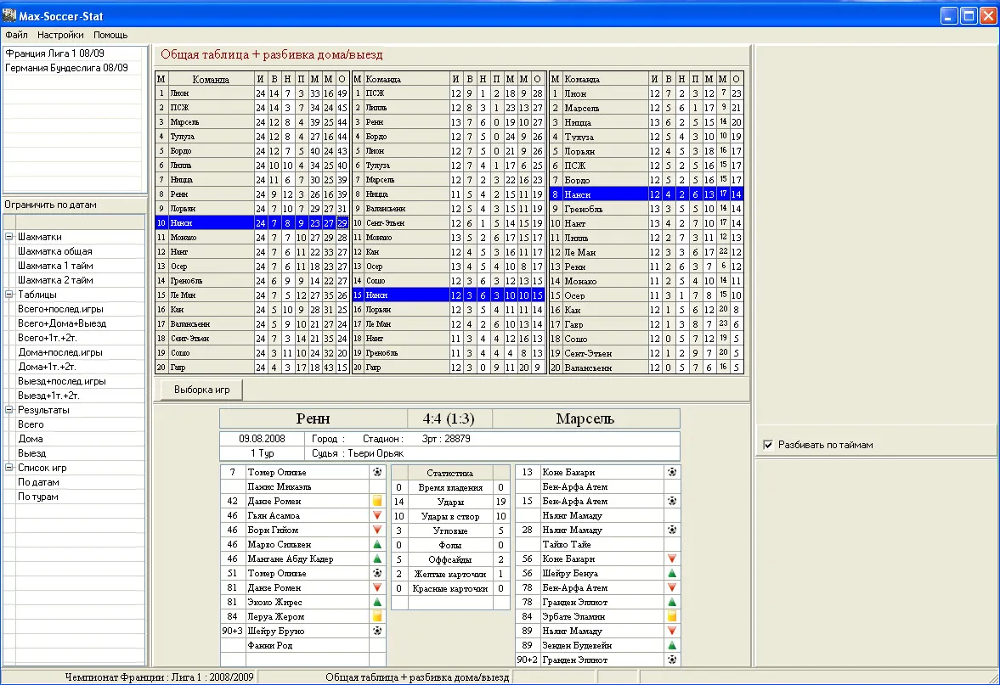
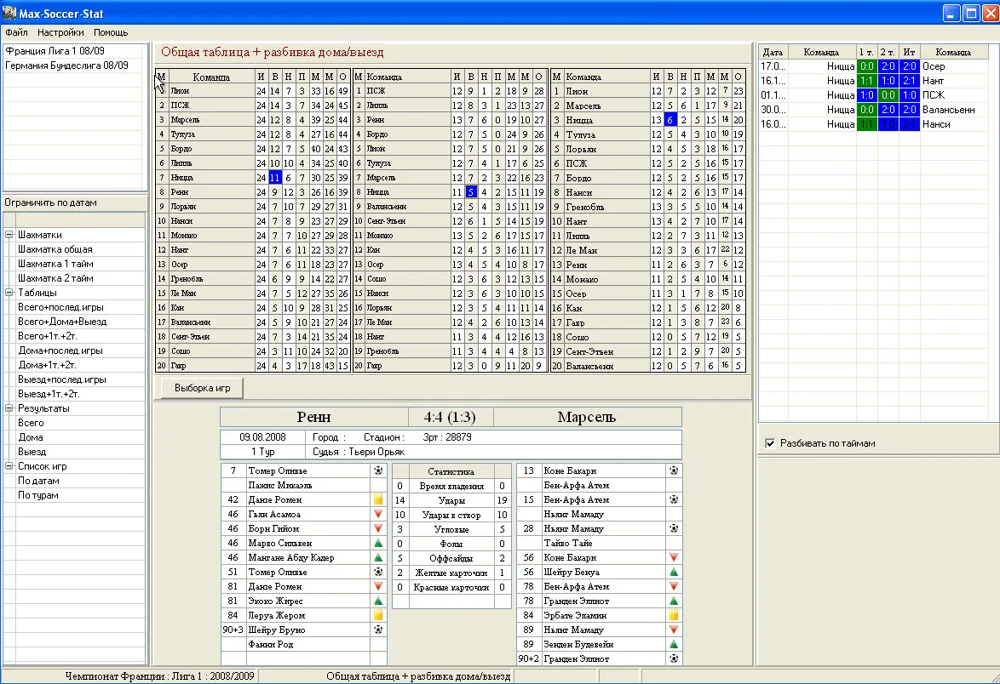
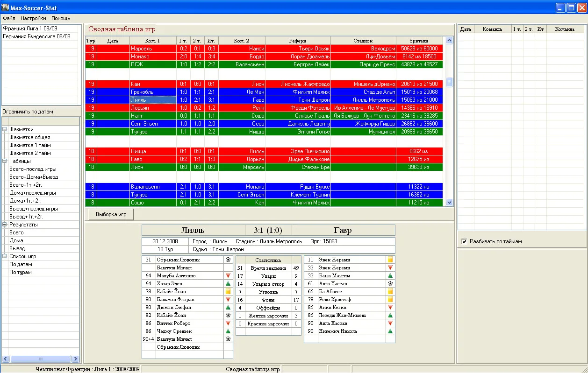
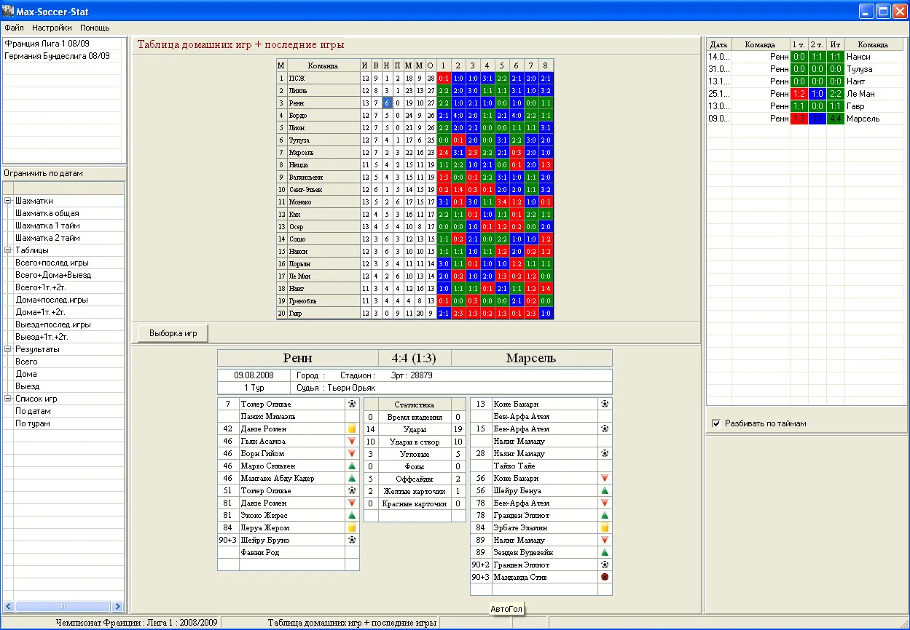
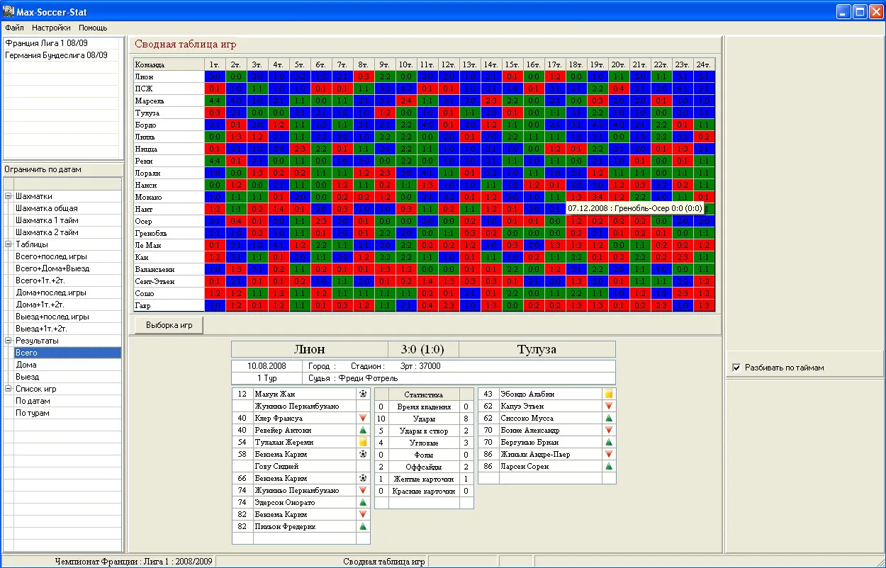
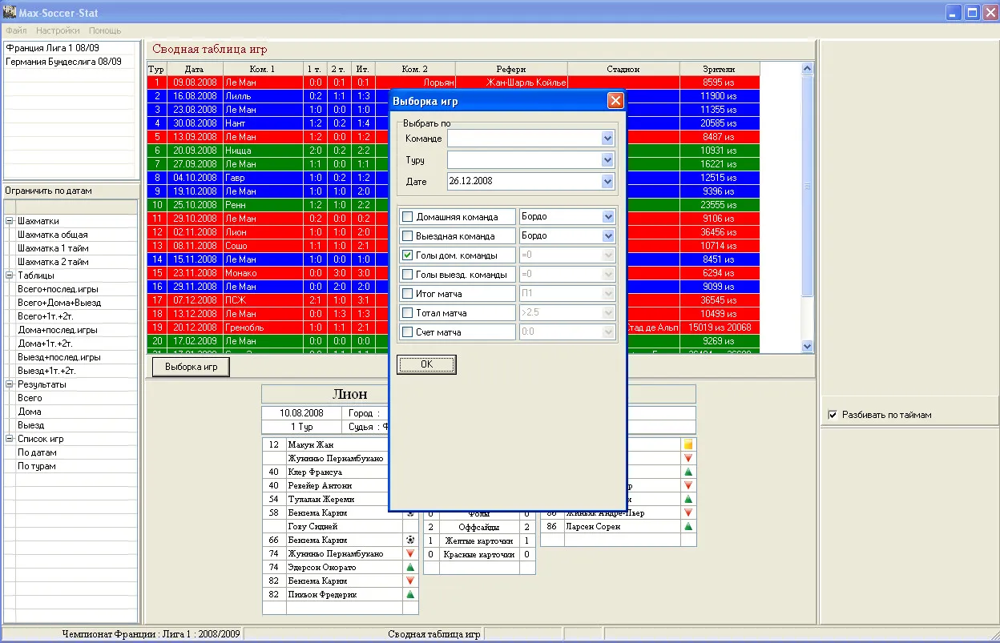

### Описание проекта для README.md

# Soccer Max Stat

**Soccer Max Stat** — это проект, разработанный для любителей футбольной статистики и аналитики, а также для тех, кто интересуется букмекерскими ставками. Проект предоставляет мощный инструмент для сбора, хранения и анализа статистики футбольных матчей и чемпионатов с интерактивными возможностями визуализации данных. Приложение позволяет отслеживать статистику как на уровне отдельных матчей, так и на уровне команд, чемпионатов и туров, предоставляя пользователю широкий выбор фильтров и способов анализа.

## Возможности проекта

### 1. Сбор и хранение статистики матчей

Проект собирает подробную информацию по каждому футбольному матчу и сохраняет ее в базе данных для дальнейшего анализа. Среди данных, которые собираются и обрабатываются:

- Общий счет матча
- Количество голов по таймам
- Желтые и красные карточки
- Удары по воротам, угловые, офсайды
- Имя судьи, название стадиона, количество зрителей
- Дата проведения матча и тур чемпионата

Эти данные вносятся в соответствующие таблицы базы данных и могут быть использованы для построения разнообразных аналитических отчетов.

### 2. Интерактивные таблицы с результатами

Проект предоставляет мощные инструменты для работы с таблицами, где можно отслеживать результаты команд в различных разрезах:

- **Шахматка**: отображает результаты матчей всех команд в виде сетки с общими итогами, а также отдельные варианты для домашних и выездных матчей.

- **Сводные таблицы**: показывают полную статистику по каждой команде, отдельно для домашних, выездных и общих игр. 
  - При нажатии на определенную команду она подсвечивается во всех трех таблицах для удобного анализа позиций.

  - Нажатие на количество побед, ничьих или поражений отображает список игр с результатами по таймам или в общем виде.

### 3. Лента матчей

Интерактивная лента матчей позволяет просматривать все игры чемпионата в разрезе по турам или датам. Для каждого матча предоставляется краткая сводка:

- Дата и тур
- Общий счет матча
- Имя судьи
- Стадион и количество зрителей

### 4. Дополнительные аналитические инструменты

- **Серии матчей**: отображение серий побед, поражений или ничьих команд.

- **Подсветка результатов**: общие таблицы с результатами матчей используют цветовую маркировку для отображения побед (синий), ничьих (зеленый) и поражений (красный).
  - При наведении мыши на ячейку появляется всплывающая подсказка с подробным результатом матча.
  - Нажатие на ячейку выводит полную информацию о матче, включая составы команд, владение мячом, угловые, офсайды и другие детали.

### 5. Гибкая фильтрация

Проект предоставляет возможность гибкой фильтрации данных. Вы можете:

- Выбирать игры одной команды (домашние или выездные).
- Фильтровать по количеству забитых голов, по счету, по ничьим и другим показателям.
- Ограничивать вывод статистики по дате, началу и концу турнира для анализа конкретных временных промежутков.

## Текущие и будущие задачи

### В планах проекта:
- **Интеграция с web API** для автоматического получения данных о матчах и их статистике.
- **Исправление багов и недочетов** для улучшения работы программы.
- **Расширение охвата статистики**, добавление новых типов данных:
  - Серии побед и поражений для команд
  - Статистика индивидуальных игроков: количество забитых мячей, передач, "сухое" время для вратарей
  - Расчет общих показателей для сравнения различных чемпионатов

## Используемые технологии

Проект разработан на языке программирования **Delphi 7**, что делает его стабильным и подходящим для настольных приложений. В проекте использованы следующие компоненты и библиотеки:

- **Компоненты NextGrid**: используются для создания интерактивных таблиц, где пользователи могут просматривать результаты матчей и команд в различных разрезах.
- **Компоненты xStringGrid**: применяются для более гибкого и настраиваемого отображения табличных данных, включая цветовую подсветку и фильтрацию.
- **RxLib 2.75**: мощная библиотека, предоставляющая дополнительные визуальные компоненты и утилиты для работы с пользовательскими интерфейсами в Delphi. В частности, она помогает организовать диалоговые окна и другие элементы интерфейса.

## Структура проекта

Проект включает следующие основные модули:

1. **Модуль сбора данных**: собирает статистику футбольных матчей и сохраняет ее в базу данных.
2. **Модуль отображения данных**: включает все интерактивные таблицы и элементы управления, такие как шахматки, сводные таблицы и лента матчей.
3. **Фильтрация и сортировка**: мощный инструмент для гибкого управления выводом данных на основе различных критериев.
4. **Аналитические инструменты**: для вычисления серий матчей, показателей команд и игроков, а также сравнения данных между различными чемпионатами.

## Требования

Для работы проекта требуется установленная Delphi 7. Кроме того, для корректной работы приложения необходимо наличие компонентов **NextGrid**, **xStringGrid** и библиотеки **RxLib 2.75**.

## Как начать работу с проектом

1. Склонируйте проект с GitHub.
2. Откройте проект в **Delphi 7**.
3. Установите необходимые компоненты:
   - **NextGrid**
   - **xStringGrid**
   - **RxLib 2.75**
4. Соберите и запустите проект.

## Заключение

**Soccer Max Stat** — это мощный инструмент для анализа футбольной статистики, который будет полезен как любителям спорта, так и профессионалам, работающим с данными матчей. Проект продолжает развиваться, и в будущих версиях планируется добавление новых функций и интеграций с внешними источниками данных.